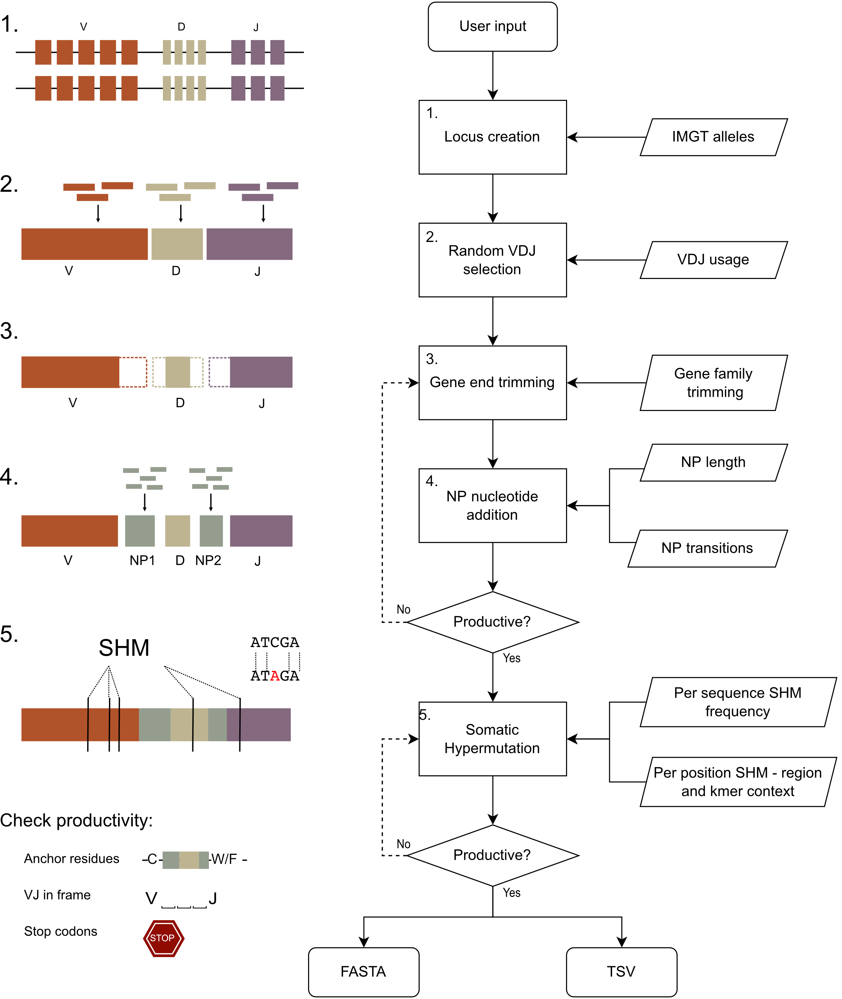

# AIRRSHIP - Adaptive Immune Receptor Repertoire Simulation of Human Immunoglobulin Production

AIRRSHIP simulates B cell receptor (BCR) sequences for use in benchmarking applications where BCR sequences of known origin are required. 

AIRRSHIP replicates the VDJ recombination process from locus creation through to somatic hypermutation. Recombination metrics are derived from a range of experimental sequences allowing faithful replication of true repertoires. Users may also control a wide range of parameters that influence allele usage, junctional diversity and somatic hypermutation rates. The current model extends to human, heavy chain sequences only. 

## Overview

**Above:** AIRRSHIP simulates human heavy chain BCR sequences, closely replicating experimental data at each step of the synthetic recombination process. Key parameters such as VDJ usage, gene trimming, junctional insertions and somatic hypermutation can all be modified by the user. The FASTA output can then analysed using tools of interest and results easily compared to the tab separated values (TSV) file which acts as a record of the recombination process for each sequence.

## Publications

A preprint giving details of AIRRSHIP is currently available on [bioRxiv](https://www.biorxiv.org/content/10.1101/2022.12.20.521228v1).

## Table of Contents

1. [Home](index.md)
2. [Quickstart](quickstart.md)
    * [Installation](quickstart.md#installation)
    * [Running from the command line](quickstart.md#commandline)
    * [Using the package in Python](quickstart.md#python)
3. [Simulation Model](model.md)
    1.  [Haplotype creation](model.md#haplotype)
    2.  [VDJ recombination](model.md#vdj)
    3.  [Trimming of gene ends](model.md#trim)
    4.  [Addition of NP nucleotides](model.md#np)
    5.  [Somatic Hypermutation](model.md#shm)
4. [Commandline Usage](parameters.md)
    * [Parameters](parameters.md#parameters)
5. [Python](python_use.md)
6. [Output Files](output.md)
    1. [Sequence FASTA](output.md#fasta)
    2. [Sequence information TSV](output.md#tsv)
    3. [ Locus file](output.md#locus)
    4. [ Summary file](output.md#summary)
7. [Input Files](data.md)
    1. [IMGT alleles](data.md#imgt-alleles)
    2. [VDJ usage](data.md#vdj-usage)
    3. [Trimming](data.md#trimming)
    4. [NP additions](data.md#np-additions)
    5. [Somatic hypermutation](data.md#somatic-hypermutation)
    6. [Experimental references](data.md#experimental-data-used)
8. [Release notes](release.md)
